# How to test REST API easily with Visual Studio Code - Thunder Client extensions
- version: 1.0
- Last update: July 2021
- Environment: Windows
- Prerequisite: [Access to RDP credentials](#prerequisite) and [Visual Studio Code](https://code.visualstudio.com/)

## <a id="intro"></a>Introduction

[Visual Studio Code](https://code.visualstudio.com/) (or just VSCode) is a free source code editor developed and maintained by [Microsoft](https://github.com/Microsoft/vscode). This cross-platform editor took over developers' popularity based on its fast and lightweight, supports a variety of programming languages with IntelliSense (a feature that borrows from its sibling, Visual Studio IDE), and supports complete development operations like debugging, task running, and version control.

VSCode also supports a lot of extensions that extends the editor features and development workflow such as code linters or testing tool such as [REST Client](https://marketplace.visualstudio.com/items?itemName=humao.rest-client), etc. The [Thunder Client](https://marketplace.visualstudio.com/items?itemName=rangav.vscode-thunder-client) is the lightweight Rest API Client Extension that allows developers to test HTTP request and view the response message with clean and simple the GUI interface in VSCode directly.


This article demonstrates how to use the REST Client extension in VSCode by using [Refinitiv Data Platform (RDP) APIs](https://developers.refinitiv.com/en/api-catalog/refinitiv-data-platform/refinitiv-data-platform-apis) as an example HTTP REST API. Developers who currently use VSCode to implement the RDP APIs application (with any languages) can use this extension to test the RDP APIs query, endpoint without switching to other tools like [Postman](https://www.postman.com/) or [cURL](https://curl.haxx.se/).

Note: RDP APIs developers still need [RDP APIs Playground page](https://api.refinitiv.com) to get the APIs document and information.

## <a id="whatis_rdp"></a>What is Refinitiv Data Platform (RDP) APIs?

The [Refinitiv Data Platform (RDP) APIs](https://developers.refinitiv.com/en/api-catalog/refinitiv-data-platform/refinitiv-data-platform-apis) provide various Refinitiv data and content for developers via easy to use Web based API.

RDP APIs give developers seamless and holistic access to all of Refinitiv content such as Historical Pricing, Environmental Social and Governance (ESG), News, Research, etc and commingled with their content, enriching, integrating, and distributing the data through a single interface, delivered wherever they need it.  The RDP APIs delivery mechanisms are the following:
* Request - Response: RESTful web service (HTTP GET, POST, PUT or DELETE) 
* Alert: delivery is a mechanism to receive asynchronous updates (alerts) to a subscription. 
* Bulks:  deliver substantial payloads, like the end of day pricing data for the whole venue. 
* Streaming: deliver real-time delivery of messages.

This example project is focusing on the Request-Response: RESTful web service delivery method only.  

For more detail regarding Refinitiv Data Platform, please see the following APIs resources: 
- [Quick Start](https://developers.refinitiv.com/en/api-catalog/refinitiv-data-platform/refinitiv-data-platform-apis/quick-start) page.
- [Tutorials](https://developers.refinitiv.com/en/api-catalog/refinitiv-data-platform/refinitiv-data-platform-apis/tutorials) page.


### <a id="rdp_workflow"></a>RDP APIs Application Workflow

Refinitiv Data Platform entitlement check is based on OAuth 2.0 specification. The first step of an application workflow is to get a token from RDP Auth Service, which will allow access to the protected resource, i.e. data REST API's. 

Next, after the application received the Access Token (an authorization token) from RDP Auth Service, all subsequent REST API calls will use this token to get the data. The application needs to input Access Token via *Authorization* HTTP request message header as shown below. 
- Header: 
    * Authorization = ```Bearer <RDP Access Token>```

Please notice *the space* between the ```Bearer``` and ```RDP Access Token``` values.

Please find more detail regarding RDP APIs workflow in the following resources:
- [RDP APIs: Introduction to the Request-Response API](https://developers.refinitiv.com/en/api-catalog/refinitiv-data-platform/refinitiv-data-platform-apis/tutorials#introduction-to-the-request-response-api) page.
- [RDP APIs: Authorization - All about tokens](https://developers.refinitiv.com/en/api-catalog/refinitiv-data-platform/refinitiv-data-platform-apis/tutorials#authorization-all-about-tokens) page.

## <a id="setup"></a>VSCode Thunder Client: Installation

Firstly, open the VSCode editor and click the ```Extensions``` button, then search the **Thunder Client** extension and click install it.

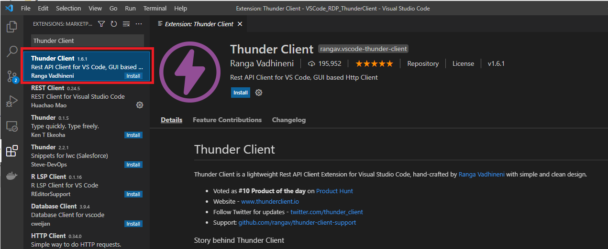 

## <a id="create_collection"></a>VSCode Thunder Client: Creating Collection

Once you have installed the extension, the Thunder Client menu will be appeared on the left toolbar of the VSCode editor. You can just click the Thunder Client menu and then click the *New Request* button to make the HTTP Request to the API endpoint.

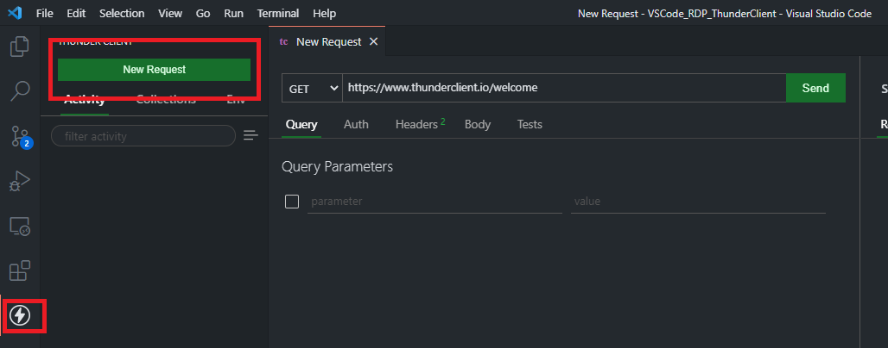 

However, a better way is to create the Collections to keep the API requests organized. You can create the APIs Collections by clicking the Collections tab, then click the right menu and choose *New Collection* menu.

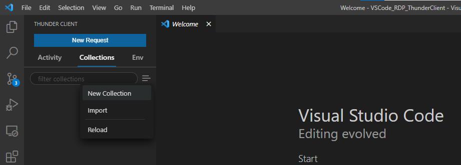 

We will use the Collection name **RDP APIs Collection** as an example Collection. You can create a HTTP request message inside the Collection by clicking the *...* menu button on the Collection name, and choose *New Request* menu. We will name this new HTTP Request as **RDP APIs Auth**

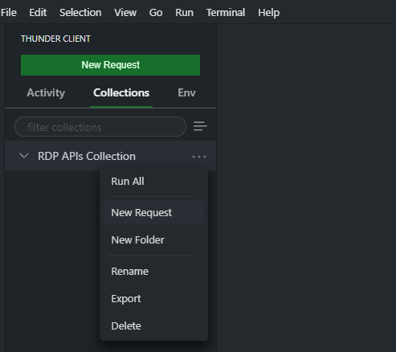 

The default API endpoint always be [https://www.thunderclient.io/welcome](https://www.thunderclient.io/welcome) URL with HTTP GET Method. You can change the URL, HTTP Method, set the HTTP Heady/Request Body, etc and press *ctrl+s* keys to save the HTTP request.

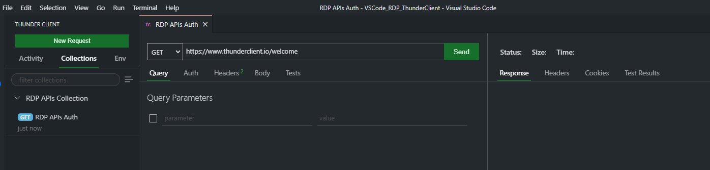 

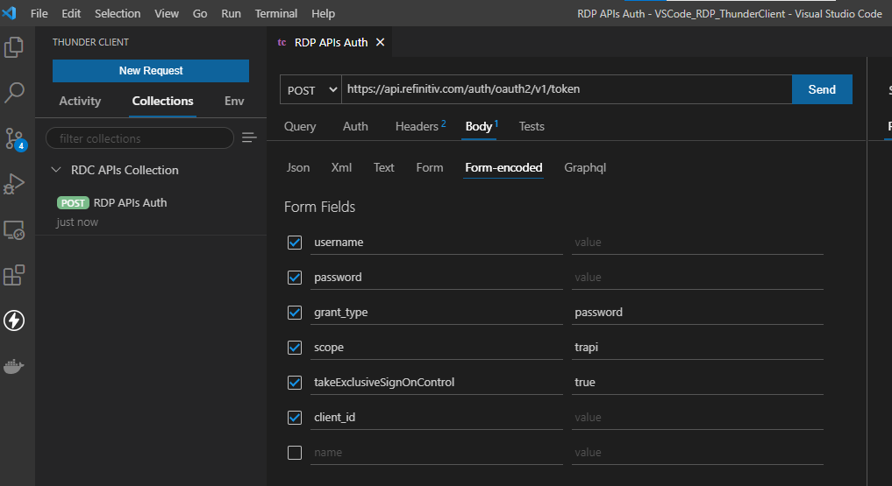 

With the above steps, you can create a simple HTTP API call to test your query parameters, API endpoints, etc. But it would be great if you use the Variables to store and reuse values in your requests. Once you have setup variables, you can reference it in your Collections, Scriptless Testing and Environment. 

## <a id="create_environments"></a>VSCode Thunder Client: Creating Environments

The Environment is a set of variables that you can reference in your Thunder Client. It can help you group related sets of variables together.

To create the new Environment, just click the Env tab, then click the right menu and choose *New Environment* menu.

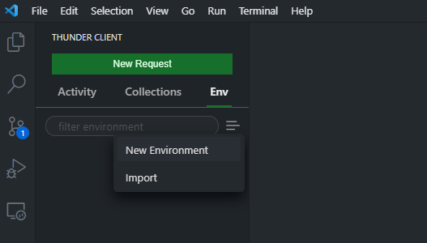 

We will use the Environment name **RDP APIs Environment** as an example Environment, then set the following variables to store RDP APIs Requests and parameters.
- ```username```: RDP Username
- ```password```: RDP Password
- ```app_key``` : RDP App Key (aka Client ID)
- ```access_token```: Variable to store RDP APIs' authentication access token
- ```refresh_token```: Variable to store RDP APIs' authentication refresh token
- ```rdp_host```: the main hostname of RDP APIs, *api.refinitiv.com*
- ```rdp_version_auth```: the RDP APIs Auth service version, *v1*

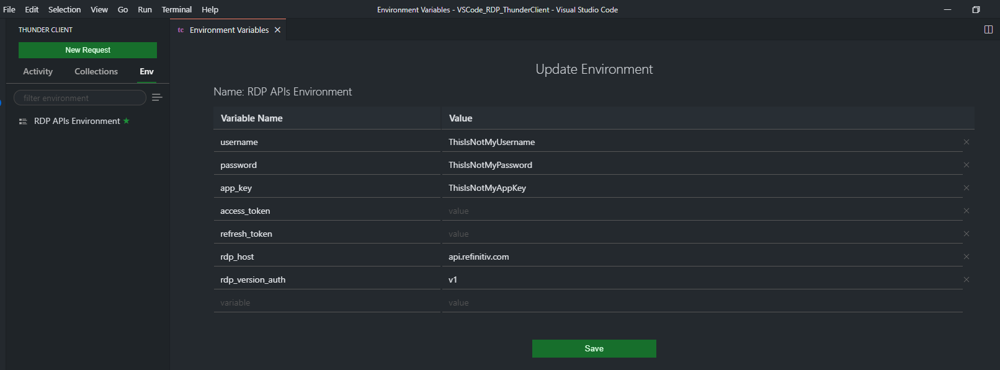 

You can use the defined variable with the following syntax in your HTTP Request URL, Request Body, Header and even the Test.

```
{{variablename}}
```

Lets get back to our **RDP APIs Auth** request, change the URL from ```https://api.refinitiv.com/auth/oauth2/v1/token``` to ```https://{{rdp_host}}/auth/oauth2/{{rdp_version_auth}}/token```, and set the parameters in the Request Body.

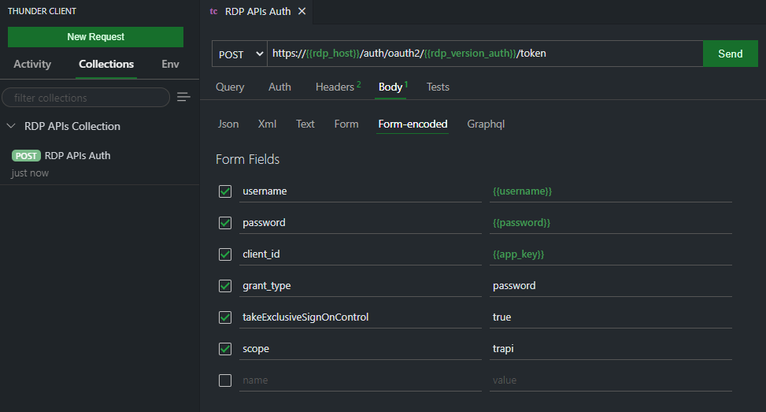

Please noticed that the RDP Auth service requires the HTTP Header's Content-Type in ```application/x-www-form-urlencoded``` format, so you need to set Request Body as ```Form-encoded``` type.

And click the Send button to send the HTTP request message. The result will be displayed in the right panel.

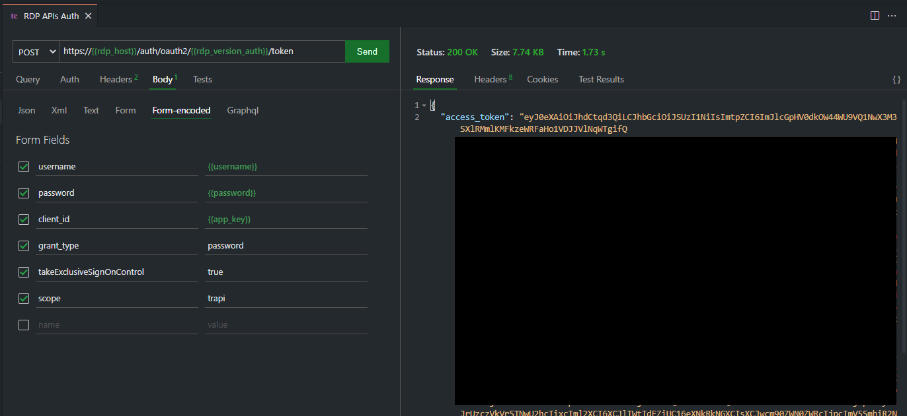

## <a id="test"></a>VSCode Thunder Client: Test

The Thunder Client also supports the scriptless testing feature that lets you create basic tests via GUI based without any manual script like the Postman. You can create the test cases in the Tests tab.

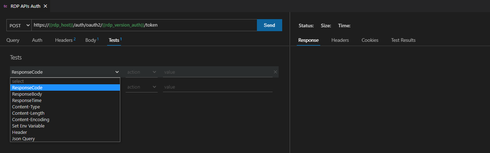

Lets create test cases for checking if HTTP Response Code is 200 (OK) and HTTP Response Content Type is application/json

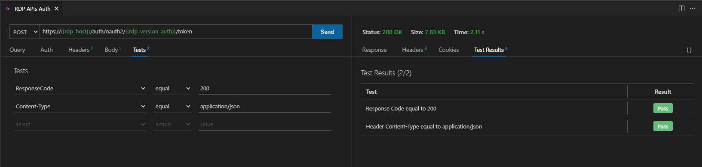

The example of the fail case is the following:

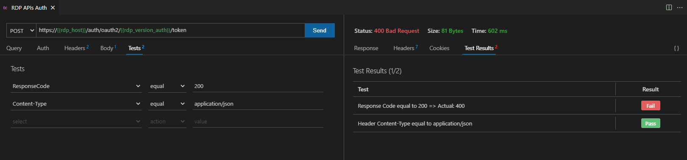

## <a id="env"></a>VSCode Thunder Client: Setting Environment Variables

To request further data and content from RDP APIs, you need to keep the Access Token value and pass it to the RDP APIs endpoint request message header with *Authorization* = ```Bearer <RDP Access Token>``` content. The Thunder Client supports set environment variable from the HTTP response message to the variable by choosing the *Set Env Variable* dropdown option in the test.

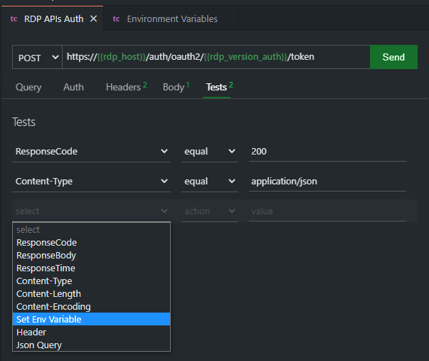

This *Set Env Variable* option lets you set the Header, Cookie, Text Response and JSON Response data to the defined variable. For RDP APIs, choose *JSON Response* and enter ```json.propertyName``` where ```propertyName``` is the JSON Key in the response body.
- ```json.access_token``` setTo ```{{access_token}}```
- ```json.refresh_token``` setTo ```{{refresh_token}}```

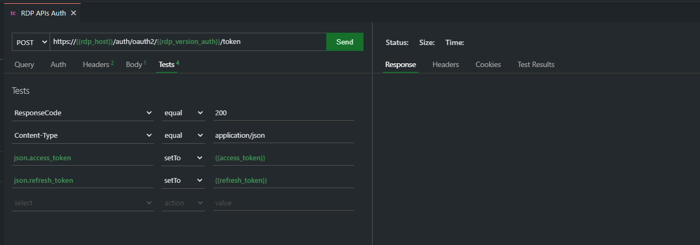

Next, execute the request and you will see the variable value set in the Env tab. 

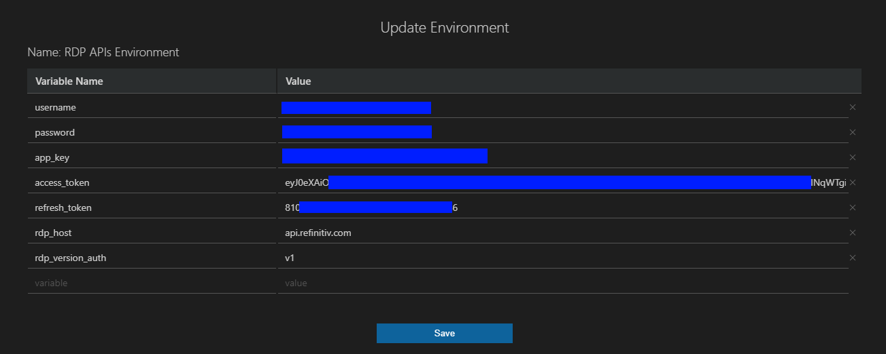

Now you can use the ```{{access_token}}``` refer to the RDP Auth Access Token in other requests.

## <a id="http_get"></a>VSCode Thunder Client: Creating HTTP Get

The next step is creating HTTP Get request example. We will use the RDP ESG (Environmental, Social and Governance) scores-full API as an example API call. The ESG scores-full provides full coverage of Refinitiv's proprietary ESG Scores with full history for consumers.

Firstly, lets create a new folder name *ESG* inside the RDP APIs Collection by clicking the *...* menu and choose *New Folder* option.

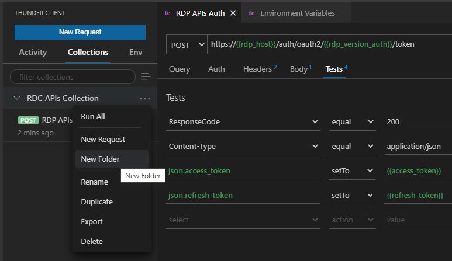

Then create new variables ```rdp_version_esg``` with ```v2``` value (the latest version of RDP ESG APIs as of *July 2021*) and ```symbol``` with ```TSLA.O``` to request Tesla, Inc. company ESG data. 

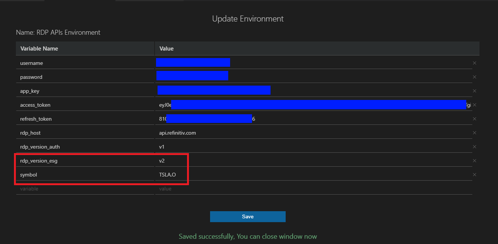

This scenario also shows benefit of using the environment variables that you can maintain each RDP API detail (such as API version) separately. 

Next, create a new HTTP request inside the ESG Collection folder with the following details:
- URL: ```https://{{rdp_host}}/data/environmental-social-governance/{{rdp_version_esg}}/views/scores-full?universe={{symbol}}```
- HTTP Method: Get (default operation)


## <a id="prerequisite"></a>Prerequisite
This demo project requires the following dependencies software.
1. RDP Access credentials.
2. [Visual Studio Code](https://code.visualstudio.com/) editor.
3. [VSCode: Thunder Client](https://marketplace.visualstudio.com/items?itemName=rangav.vscode-thunder-client) extension.
4. Internet connection.

Please contact your Refinitiv's representative to help you to access Refinitiv Data Platform credentials. You can follow the step-by-step guide to complete your RDP credentials setup from the *Getting Started for User ID* section of the [Getting Start with Refinitiv Data Platform](https://developers.refinitiv.com/en/article-catalog/article/getting-start-with-refinitiv-data-platform) article.


## <a id="conclusion"></a>Conclusion

You may think "why would I bother to use this extension when I already have a Postman". The Postman is a complete platform for API testing and development so it has many more features than this extension. However, this VSCode: REST Client extension lets developers who are using this editor do a quick REST API test call such as test various API query parameters, test new Service URL, or test different credentials *in the same tool that they are developing the application*. Developers do not need to switch a tool for a quick REST API query test anymore. 

This extension helps RDP APIs developers (either who use the REST API directly or [RDP Libraries](https://developers.refinitiv.com/en/api-catalog/refinitiv-data-platform/refinitiv-data-platform-libraries) with Visual Studio Code to implement application a smooth and seamless workflow.

## <a id="references"></a>References
For further details, please check out the following resources:
* [Refinitiv Data Platform APIs page](https://developers.refinitiv.com/en/api-catalog/refinitiv-data-platform/refinitiv-data-platform-apis) on the [Refinitiv Developer Community](https://developers.refinitiv.com/) website.
* [Refinitiv Data Platform APIs Playground page](https://api.refinitiv.com).
* [Refinitiv Data Platform APIs: Introduction to the Request-Response API](https://developers.refinitiv.com/en/api-catalog/refinitiv-data-platform/refinitiv-data-platform-apis/tutorials#introduction-to-the-request-response-api).
* [Refinitiv Data Platform APIs: Authorization - All about tokens](https://developers.refinitiv.com/en/api-catalog/refinitiv-data-platform/refinitiv-data-platform-apis/tutorials#authorization-all-about-tokens).
* [Visual Studio Code product page](https://code.visualstudio.com/)
* [Introduction to Thunder Client blog](https://rangav.medium.com/thunder-client-alternative-to-postman-68ee0c9486d6).
* [VSCode: Thunder Client product page](https://marketplace.visualstudio.com/items?itemName=rangav.vscode-thunder-client) and [GitHub](https://github.com/rangav/thunder-client-support).

For any questions related to Refinitiv Data Platform, please use the Developers Community [Q&A Forum](https://community.developers.refinitiv.com/spaces/231/index.html).