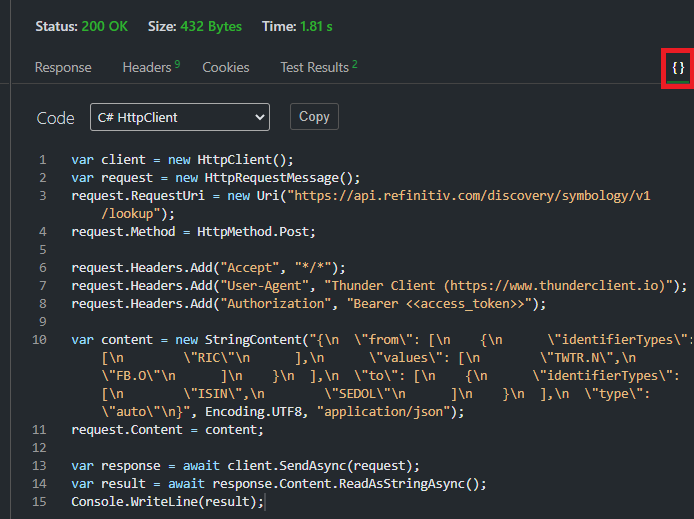

# How to test HTTP REST API easily with Visual Studio Code - Thunder Client extensions
- version: 2.0
- Last update: January 2025
- Environment: Windows
- Prerequisite: [Access to RDP credentials](#prerequisite) and [Visual Studio Code](https://code.visualstudio.com/)

## <a id="intro"></a>Introduction

[Visual Studio Code](https://code.visualstudio.com/) (or just VSCode) is a free source code editor developed and maintained by [Microsoft](https://github.com/Microsoft/vscode). This cross-platform editor took over developers' popularity based on its fast and lightweight, supports a variety of programming languages with IntelliSense (a feature that borrows from its sibling, Visual Studio IDE), and supports complete development operations like debugging, task running, and version control.

VSCode also supports a lot of extensions that extend the editor features and development workflows such as code linters or testing tools such as [REST Client](https://marketplace.visualstudio.com/items?itemName=humao.rest-client), etc. The [Thunder Client](https://marketplace.visualstudio.com/items?itemName=rangav.vscode-thunder-client) ([Official website](https://www.thunderclient.com/))  is the lightweight Rest API Client Extension that allows developers to test HTTP request and view the response message with a clean and simple GUI interface in VSCode directly.

This article demonstrates how to use the Thunder Client extension in VSCode by using [Delivery Platform (RDP) APIs](https://developers.lseg.com/en/api-catalog/refinitiv-data-platform/refinitiv-data-platform-apis) (previously known as Refinitiv Data Platform) as an example HTTP REST API. Developers who currently use VSCode to implement the RDP APIs application (with any languages) can use this extension to test the RDP APIs query, endpoint without switching to other tools like [Postman](https://www.postman.com/) or [cURL](https://curl.haxx.se/).

Note: RDP APIs developers still need [RDP APIs Playground page](https://apidocs.refinitiv.com/Apps/ApiDocs) to get the APIs document and information.

**As Of January 2025**: [Thunder Client pricing plan has been updated](https://www.thunderclient.com/pricing). The free version is for non-commercial use only with [limitations](https://www.thunderclient.com/pricing#compare).

## <a id="prerequisite"></a>Prerequisite
This demo project requires the following dependencies software.
1. RDP Access credentials.
2. [Visual Studio Code](https://code.visualstudio.com/) editor.
3. [VSCode: Thunder Client](https://marketplace.visualstudio.com/items?itemName=rangav.vscode-thunder-client) extension.
4. Internet connection.

Please contact your LSEG representative to help you to access RDP credentials. You can follow the step-by-step guide to complete your RDP credentials setup from the *Getting Started for User ID* section of the [Getting Start with RDP](https://developers.lseg.com/en/article-catalog/article/getting-start-with-refinitiv-data-platform) article.

## <a id="whatis_rdp"></a>What is RDP APIs?

The [Delivery Platform (RDP) APIs](https://developers.lseg.com/en/api-catalog/refinitiv-data-platform/refinitiv-data-platform-apis) (previously known as Refinitiv Data Platform) provide various LSEG data and content for developers via easy to use Web based API.

RDP APIs give developers seamless and holistic access to all of the LSEG content such as Historical Pricing, Environmental Social and Governance (ESG), News, Research, etc and commingled with their content, enriching, integrating, and distributing the data through a single interface, delivered wherever they need it.  The RDP APIs delivery mechanisms are the following:
* Request - Response: RESTful web service (HTTP GET, POST, PUT or DELETE) 
* Alert: delivery is a mechanism to receive asynchronous updates (alerts) to a subscription. 
* Bulks:  deliver substantial payloads, like the end of day pricing data for the whole venue. 
* Streaming: deliver real-time delivery of messages.

This example project is focusing on the Request-Response: RESTful web service delivery method only.  

For more detail regarding RDP APIs, please see the following APIs resources: 
- [Quick Start](https://developers.lseg.com/en/api-catalog/refinitiv-data-platform/refinitiv-data-platform-apis/quick-start) page.
- [Tutorials](https://developers.lseg.com/en/api-catalog/refinitiv-data-platform/refinitiv-data-platform-apis/tutorials) page.


## <a id="rdp_workflow"></a>RDP APIs Application Workflow

RDP APIs entitlement check is based on OAuth 2.0 specification. The first step of an application workflow is to get a token from RDP Auth Service, which will allow access to the protected resource, i.e. data REST API's. 

Next, after the application received the Access Token (an authorization token) from RDP Auth Service, all subsequent REST API calls will use this token to get the data. The application needs to input Access Token via *Authorization* HTTP request message header as shown below. 
- Header: 
    * Authorization = ```Bearer <RDP Access Token>```

Please notice *the space* between the ```Bearer``` and ```RDP Access Token``` values.

Please find more detail regarding RDP APIs workflow in the following resources:
- [RDP APIs: Introduction to the Request-Response API](https://developers.lseg.com/en/api-catalog/refinitiv-data-platform/refinitiv-data-platform-apis/tutorials#introduction-to-the-request-response-api) page.
- [RDP APIs: Authorization - All about tokens](https://developers.lseg.com/en/api-catalog/refinitiv-data-platform/refinitiv-data-platform-apis/tutorials#authorization-all-about-tokens) page.
- [Changes to Customer Access and Identity Management: Version 2 Authentication](https://developers.lseg.com/en/article-catalog/article/changes-to-customer-access-and-identity-management--refinitiv-re) article.

## <a id="howto_thunderclient"></a>How to use VSCode Thunder Client extension

### <a id="setup"></a>VSCode Thunder Client: Installation

Firstly, open the VSCode editor and click the ```Extensions``` button, then search the **Thunder Client** extension and click install it.

 

### <a id="create_collection"></a>Creating Collection

Once you have installed the extension, the Thunder Client menu will appear on the left toolbar of the VSCode editor. You can just click the Thunder Client menu and then click the *New Request* button to make the HTTP Request to the API endpoint.

 

However, a better way is to create the Collections to keep the API requests organized. You can create the APIs Collections by clicking the Collections tab, then click the right menu and choose the *New Collection* menu.

 

We will use the Collection name **RDP APIs Collection** as an example Collection. You can create a HTTP request message inside the Collection by clicking the *...* menu button on the Collection name, and choose the *New Request* menu. We will name this new HTTP Request as **RDP APIs Auth**

 

The default API endpoint always is [https://www.thunderclient.io/welcome](https://www.thunderclient.io/welcome) URL with HTTP GET Method. You can change the URL, HTTP Method, set the HTTP Heady/Request Body, etc, and press *ctrl+s* keys to save the HTTP request.

 

 

With the above steps, you can create a simple HTTP API call to test your query parameters, API endpoints, etc. But it would be great if you use the Variables to store and reuse values in your requests. Once you have set up variables, you can reference them in your Collections, Scriptless Testing, and Environment. 

### <a id="create_environments"></a>Creating Request Environment

The Environment is a set of variables that you can reference in your Thunder Client. It can help you group related sets of variables together.

To create the new Environment, just click the Env tab, then click the right menu and choose the *New Environment* menu.

 

We will use the Environment name **RDP APIs Environment** as an example Environment, then set the following variables to store RDP APIs Requests and parameters.
- ```username```: RDP Username
- ```password```: RDP Password
- ```app_key``` : RDP App Key (aka Client ID)
- ```access_token```: Variable to store RDP APIs' authentication access token
- ```refresh_token```: Variable to store RDP APIs' authentication refresh token
- ```rdp_host```: the main hostname of RDP APIs, *api.refinitiv.com*
- ```rdp_version_auth```: the RDP APIs Auth service version, *v1*

 

You can use the defined variable with the following syntax in your HTTP Request URL, Request Body, Header, and even the Test.

```
{{variablename}}
```

Lets get back to our **RDP APIs Auth** request, change the URL from ```https://api.refinitiv.com/auth/oauth2/v1/token``` to ```https://{{rdp_host}}/auth/oauth2/{{rdp_version_auth}}/token```, and set the parameters in the Request Body.


Please noticed that the RDP Auth service requires the HTTP Header's Content-Type in ```application/x-www-form-urlencoded``` format, so you need to set Request Body as ```Form-encoded``` type.

And click the Send button to send the HTTP request message. The result will be displayed in the right panel.


**Note**: This example is based on the Version 1 Authentication. You can find more detail about the Version 2 Authentication from [Changes to Customer Access and Identity Management: Version 2 Authentication](https://developers.lseg.com/en/article-catalog/article/changes-to-customer-access-and-identity-management--refinitiv-re) article.

### <a id="test"></a>Creating Test

The Thunder Client also supports the scriptless testing feature that lets you create basic tests via GUI-based without any manual script like the Postman. You can create the test cases in the Tests tab.


Let's create test cases for checking if HTTP Response Code is 200 (OK) and HTTP Response Content Type is application/json


The example of the fail case is the following:


### <a id="env"></a>Setting Environment Variables

To request further data and content from RDP APIs, you need to keep the Access Token value and pass it to the RDP APIs endpoint request message header with *Authorization* = ```Bearer <RDP Access Token>``` content. The extension lets you set the environment variables from the HTTP response message to the variable by choosing the *Set Env Variable* dropdown option in the test.


This *Set Env Variable* option lets you set the Header, Cookie, Text Response and JSON Response data to the defined variable. For RDP APIs, choose *JSON Response* and enter ```json.propertyName``` where ```propertyName``` is the JSON Key in the response body.
- ```json.access_token``` setTo ```{{access_token}}```
- ```json.refresh_token``` setTo ```{{refresh_token}}```


Next, execute the request and you will see the variable value set in the Env tab. 


Now you can use the ```{{access_token}}``` refer to the RDP Auth Access Token in other requests.

### <a id="http_get"></a>Creating HTTP Get Request

The next step is creating the HTTP Get request example. We will use the RDP ESG (Environmental, Social, and Governance) scores-full API as an example API call. The ESG scores-full provides full coverage of LSEG's proprietary ESG Scores with full history for consumers.

Firstly, let's create a new folder name *ESG* inside the RDP APIs Collection by clicking the *...* menu and choose the *New Folder* option.


Then create new variables ```rdp_version_esg``` with ```v2``` value (the latest version of RDP ESG APIs as of *July 2021*) and ```symbol``` with ```TSLA.O``` to request Tesla, Inc. company ESG data. 


This scenario also shows the benefit of using the environment variables that you can maintain each RDP API detail (such as API version) separately. 

Next, create a new HTTP request name *ESG - Score Full* inside the ESG Collection folder with the following details:
- URL: ```https://{{rdp_host}}/data/environmental-social-governance/{{rdp_version_esg}}/views/scores-full?universe={{symbol}}```
- HTTP Method: Get (default operation)


To set the ```{{access_token}}``` RDP API HTTP Request message header, just click the Auth tab under the HTTP Request and select ```Bearer Token``` type. 


Then click the send button to send the HTTP request message, the result will be shown in the right panel.


### <a id="http_post"></a>Creating HTTP Post Request

The next step is creating the HTTP Post request example. We will use the RDP Symbology API as an example API call. The API enables customers to map from external identifiers to a LSEG PermID and to navigate between a wide range of identifiers.  

Firstly, let's create a new folder name *Symbology* inside the RDP APIs Collection by clicking the *...* menu and choose the *New Folder* option. Then create new variables ```rdp_version_symbology``` with ```v1``` value. 


Next, create a new HTTP request name *Identifier to PermID* inside the Symbology folder with the following details:
- URL: ```https://{{rdp_host}}/discovery/symbology/{{rdp_version_symbology}}/lookup```
- HTTP Method: Post
- HTTP Auth: Bearer Token with ```{{access_token}}```


Then select the Request Body tab under the request message, choose *Json* and input the following JSON request message to the body text area. This JSON request message is for requesting the Organization PermID of Toyota Motor Corp (*7203.T*) and Tesla, Inc. companies. Please noticed that you can use the variable ```{{symbol}}``` (which is currently store *TSLA.O* instrument) in the request message body too. 

``` json
{
  "from": [
    {
      "identifierTypes": [
        "RIC"
      ],
      "values": [
        "7203.T",
        "{{symbol}}"
      ]
    }
  ],
  "to": [
    {
      "objectTypes": [
        "organization"
      ],
      "identifierTypes": [
        "PermID"
      ]
    }
  ],
  "type": "auto"
}
```


And send the request message, the success result will look like this:


### <a id="multiple_envs"></a>Multiple Environments Management

If you have multiple Environments (for Development, Test, and Production, etc.), you can choose the active Environment by clicking the *...* menu next to the Environment and choose the *Set Active* menu.


The current active Environment will display a star icon next to the Environment name.


### <a id="code_generator"></a>Code Generator

The extension lets you generate a code snippet from the request by opening the request view and click the *{}* in the right panel to show the Code tab.



Please be informed that all of your request information including the credentials, tokens will be embedded in the code too, so please be careful when sharing the snippet code.

The tool currently supports the following languages:
- C# - HttpClient
- cURL
- JavaScript Fetch & Axios
- Python requests & http.client


### <a id="export_requests"></a>Exporting Request Collections and Environments

You can export the HTTP Request Collection and Environment to the JSON files. The exported Collection JSON file will contain everything such as the Collection structure, HTTP URL, Request Body, Header, Tests, etc. Then you can share the JSON files with your colleagues to create the same HTTP test environment. 

**Note**: Please note that the exported Environment JSON file **always contains all of your credentials**. Please clear your credentials, tokens before exporting the Environment and share them with your peers (or add to software version control). 

You can click the Collection/Env menu and choose the *Export* option.


The above video shows how to export Collection to *thunder-collection_RDP APIs Collection.json* file and export Environment to *thunder-environment_RDP APIs Environment.json* file. Both of them are the default file names.

### <a id="import_requests"></a>Importing Request Collections and Environments

You can click the Collection/Env menu and choose the *Import* option.


### <a id="import_postman"></a>Importing Postman Request Collections and Environments 

The VSCode Thunder Client extension supports the Collection and Environment files from Postman 2.1.0 format. The RDP APIs have the Postman Starter Collection and Tutorials Samples for developers on the [RDP APIs download page](https://developers.lseg.com/en/api-catalog/refinitiv-data-platform/refinitiv-data-platform-apis/download). The package contains the following files:
- *RDP.postman_collection_{date}.json*: The RDP APIs collection file
- *RDP Env Starter.postman_environment_{date}.json*: The RDP APIs environment file


The environment *RDP Env Starter.postman_environment_{date}.json* JSON file is ready to import to the Thunder Client. But unfortunately, the current *RDP.postman_collection_{date}.json* file based on Postman 2.0 format. You need to import the *RDP.postman_collection_{date}.json* file to Postman first, and then export the collection to the JSON file with Postman 2.1.0 format.


Then use the same steps as [the above section](#export_import) to import the environment and saved Postman version 2.1.0 collection file to Thunder Client.


## <a id="application_files"></a>Project Application Files
This example project contains the following files and folders
1. *thunder-collection_RDP APIs Collection.json*: The example Collection JSON file for RDP APIs.
2. *thunder-environment_RDP APIs Environment.json*: The example Environment JSON file for RDP APIs.
3. *images*: Project images folder.
4. *LICENSE.md*: Project's license file.
5. *README.md*: Project's README file.

## <a id="project_setup"></a>VSCode Thunder Client and Project Setup

1. Once you have unzipped or downloaded the example project folder into a directory of your choice, you can set up the VSCode Thunder Client extension with the step from the [above section](#setup).
2. Then import the *thunder-collection_RDP APIs Collection.json* and *thunder-environment_RDP APIs Environment.json* files to Thunder Client with the steps from the [import section](#import_requests).
3. Input your RDP APIs credentials to the Environment.

Now the VSCode editor is ready to request data from RDP REST APIs.

## <a id="conclusion"></a>Conclusion

You may think "why would I bother to use this extension when I already have a Postman". The Postman is a complete platform for API testing and development so it has many more features than this extension. However, this VSCode: Thunder Client extension lets developers who are using this editor do a quick REST API test call such as test various API query parameters, test new Service URL, or test different credentials *in the same tool that they are developing the application* with the simple GUI interface. Developers do not need to switch a tool or write a script for a quick REST API query test anymore. 

This extension helps RDP APIs developers (either who use the REST API directly or [Data Library](https://developers.lseg.com/en/api-catalog/lseg-data-platform/lseg-data-library-for-python)) with Visual Studio Code to implement application a smooth and seamless workflow.

*Note*: The another VS Code REST API extension that I recommend is the [REST Client](https://marketplace.visualstudio.com/items?itemName=humao.rest-client) for those who love to write simple scripts to test the HTTP REST APIs. Please see more detail about the REST Client extension on [this article](https://medium.com/refinitiv-developer-community/how-to-test-rest-api-with-visual-studio-code-rest-client-extensions-9f2e061d0299).

## <a id="references"></a>References

For further details, please check out the following resources:

* [Delivery Platform (RDP) APIs page](https://developers.lseg.com/en/api-catalog/refinitiv-data-platform/refinitiv-data-platform-apis) on the [LSEG Developers Community](https://developers.lseg.com/) website.
* [RDP APIs Playground page](https://apidocs.refinitiv.com/Apps/ApiDocs).
* [RDP APIs: Introduction to the Request-Response API](https://developers.lseg.com/en/api-catalog/refinitiv-data-platform/refinitiv-data-platform-apis/tutorials#introduction-to-the-request-response-api).
* [RDP APIs: Authorization - All about tokens](https://developers.lseg.com/en/api-catalog/refinitiv-data-platform/refinitiv-data-platform-apis/tutorials#authorization-all-about-tokens).
- [Changes to Customer Access and Identity Management: Version 2 Authentication](https://developers.lseg.com/en/article-catalog/article/changes-to-customer-access-and-identity-management--refinitiv-re) article.
* [Visual Studio Code product page](https://code.visualstudio.com/)
* [Introduction to Thunder Client blog](https://rangav.medium.com/thunder-client-alternative-to-postman-68ee0c9486d6).
* [VSCode: Thunder Client product page](https://marketplace.visualstudio.com/items?itemName=rangav.vscode-thunder-client) and [GitHub](https://github.com/rangav/thunder-client-support).

For any questions related to the Delivery Platform, please use the Developers Community [Q&A Forum](https://community.developers.refinitiv.com).